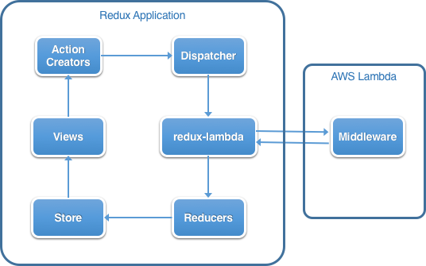

# redux-lambda

This package provides a Redux middleware to call AWS Lambda functions, and a module to use Rudux middleware as a AWS Lambda function.



## Installation

```
npm install redux-lambda -S
```

## License

MIT
